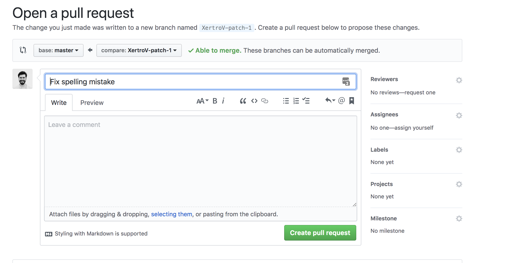
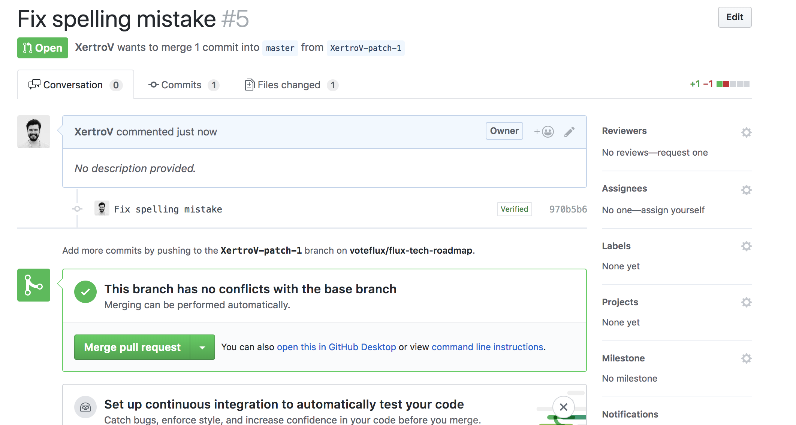
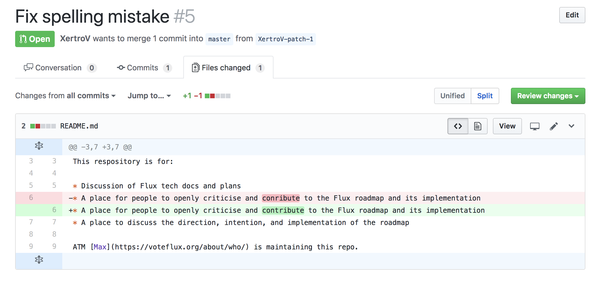
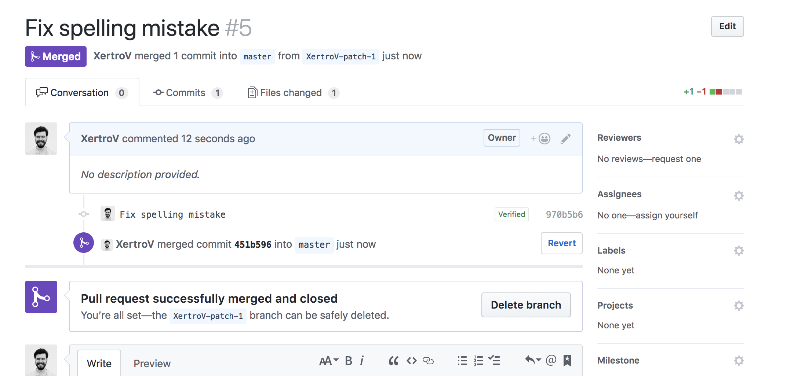
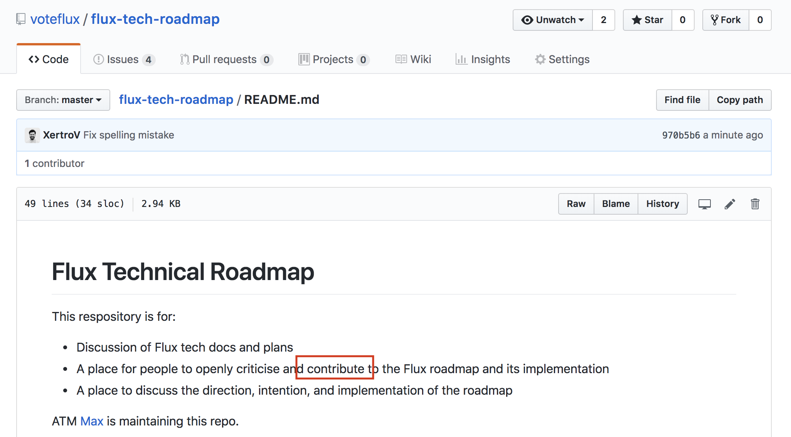

Contributing
============

Most of this file is still todo

Editing files and making a pull request
~~~~~~~~~~~~~~~~~~~~~~~~~~~~~~~~~~~~~~~

Find a mistake or figure out what you want to edit
^^^^^^^^^^^^^^^^^^^^^^^^^^^^^^^^^^^^^^^^^^^^^^^^^^

.. figure:: eMju5xS.png
   :alt: find a mistake

   find a mistake

Then click edit
^^^^^^^^^^^^^^^

(Make sure you’re viewing the file itself)

.. figure:: M9WwTcA.png
   :alt: click edit in top right

   click edit in top right

Make your changes
^^^^^^^^^^^^^^^^^

.. figure:: BmzDFTE.png
   :alt: find the mistake

   find the mistake

.. figure:: VTBaxBS.png
   :alt: change what needs to be changed

   change what needs to be changed

Commit changes
^^^^^^^^^^^^^^

Make sure you select “Create a **new branch** for this commit and start
a pull request” if the option is available.

.. figure:: oxUHCgL.png
   :alt: commit changes

   commit changes

Type in a message and click “Propose file change”

Add any details to the pull request if you need to - then create pull request
^^^^^^^^^^^^^^^^^^^^^^^^^^^^^^^^^^^^^^^^^^^^^^^^^^^^^^^^^^^^^^^^^^^^^^^^^^^^^

   fill in pull request details

Click “create pull request”

Pull request created! you’ll be automatically emailed if anyone comments or mentions you on the pull request
^^^^^^^^^^^^^^^^^^^^^^^^^^^^^^^^^^^^^^^^^^^^^^^^^^^^^^^^^^^^^^^^^^^^^^^^^^^^^^^^^^^^^^^^^^^^^^^^^^^^^^^^^^^^

   pull request created

Look in the “Files changed” tab to see changes (optional)
^^^^^^^^^^^^^^^^^^^^^^^^^^^^^^^^^^^^^^^^^^^^^^^^^^^^^^^^^

   files changed

Once your PR (pull request) has been accepted you’ll see this and can delete the branch you made the edit on
^^^^^^^^^^^^^^^^^^^^^^^^^^^^^^^^^^^^^^^^^^^^^^^^^^^^^^^^^^^^^^^^^^^^^^^^^^^^^^^^^^^^^^^^^^^^^^^^^^^^^^^^^^^^

   pr accepted

Your changes will be live
^^^^^^^^^^^^^^^^^^^^^^^^^

   changes live